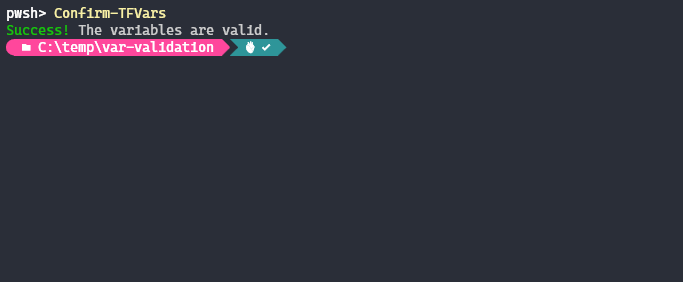
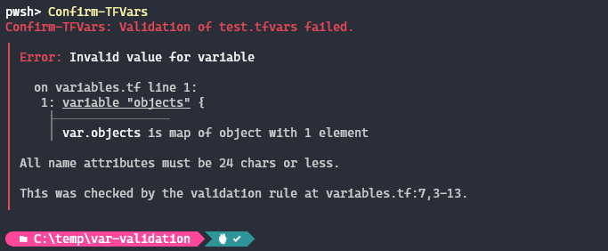

# Confirm-TFVars

A cross platform PowerShell module to validate tfvars files based on variable definition and validation rules.

| GitHub Actions                                      | PSGallery                                               | Latest Version                  |
|:---------------------------------------------------:|:-------------------------------------------------------:|:-------------------------------:|
| [![PublishStatus][publish-badge]][publish-pipeline] | [![PowerShell Gallery][psgallery-badge]][psgallery-url] | ![GitHubTag][version-tag-badge]

## Why?

Working with terraform on a daily basis, for most of the projects I work on terraform plan and apply are ran via CICD pipeline, and access to the state backend restricted. My typical workflow is to run `terraform validate` to confirm syntax before committing any code. It's always bugged me there is no out of the box dedicated solution to also validate content of tfvars files against the variable definitions and validation rules. This can result in committing code and waiting for a CICD pipeline to throw an error before you know anything is wrong.

Why not just run `terraform plan` locally to catch this? After all thats what the Hashicorp documentation eludes to [here](https://developer.hashicorp.com/terraform/cli/commands/validate).

On most projects I work on, as stated above terraform is ran via CICD pipeline. Running a plan locally isn't always possible because of one or more of the following reasons:

- My local machine doesn't have access to the tfstate back end.
- I don't have credentials readily available to authenticate to all of the included providers.
- I don't have readily available all variable values the pipeline is passing to terraform via CLI.

## How?

The `terraform console` command parses tfvars files and this is what the module exploits. It is essentially a wrapper to have terraform console test tfvars files in isolation from anything else in a terraform project and provide a success or failure result.

## Pre-reqs

Terraform CLI must already be installed, and the terraform command must be located in one of the paths defined in your path env var.

Your terraform config needs to have the variables defined for the tfvars in its own dedicated file e.g. `variables.tf`.

## Installation

The module is compatible with Windows PowerShell and PowerShell Core (Windows & Linux.)

To install the module from the [PowerShell Gallery](https://www.powershellgallery.com/):

```powershell
Install-Module -Name Confirm-TFVars -Repository PSGallery
```

## Usage

Full native PowerShell help is available in the module via `Get-Help`.

```powershell
Get-Help Confirm-TFVars -Full
```

The following two Cmdlets are included in the module:

|  Cmdlet                                | Description                                                                                           |
|----------------------------------------|-------------------------------------------------------------------------------------------------------|
| Confirm-TFVars                         | The main functionality used to validate tfvars files.
| Confirm-TF                             | Runs `terraform validate` and `confirm-tfvars` in sequence and confirms overall validation of the two.

## What to expect

The output mirrors native terraform output, any errors are passed directly from terraform to the console.

### <u>Success Example</u>



### <u>Failure Example</u>



[publish-badge]: https://img.shields.io/github/actions/workflow/status/jamesw4/confirm-tfvars/publish.yml?logo=github&label=Publish
[publish-pipeline]: https://github.com/jamesw4/Confirm-TFVars/actions/workflows/publish.yml
[psgallery-badge]: https://img.shields.io/powershellgallery/dt/Confirm-TFVars?label=Downloads&logo=powershell&color=0a7bbc
[psgallery-url]: https://www.powershellgallery.com/packages/Confirm-TFVars
[version-tag-badge]: https://img.shields.io/github/v/tag/jamesw4/Confirm-TFVars?label=Version&logo=task
